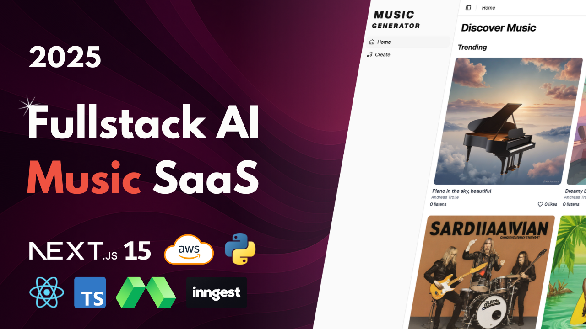

# AI Music Generation



[Link to video](https://youtu.be/fC3_Luf7wVA)

[Discord and more](https://www.andreastrolle.com/)

## Overview

Hi 🤙 In this project, you'll build a SaaS application that generates original music using AI. The tool uses a state-of-the-art music generation model to create songs from simple text descriptions, custom lyrics, or style prompts. You'll learn how to build a complete production-ready SaaS with user authentication, a credit-based payment system using Polar.sh, and background processing queues to handle user load. All services used in this project are free, so you won't have to pay anything to follow along. We'll use technologies such as Next.js 15, React, Typescript, Tailwind CSS, ShadCN, BetterAuth, Polar, Python, FastAPI, Modal, Inngest, Neon, S3 on AWS, and more.

Features:

- 🎵 AI Music Generation with ACE-Step
- 🧠 LLM-Powered Lyric & Prompt Generation with Qwen2-7B
- 🖼️ AI Thumbnail Generation with stabilityai/sdxl-turbo
- 🎤 Multiple Generation Modes for descriptions, custom lyrics, or described lyrics
- 🎸 Instrumental Tracks option to generate music without vocals
- ⚡ Serverless GPU Processing with Modal for fast generation
- 📊 Queue System with Inngest for handling generation tasks in the background
- 💳 Credit-Based System
- 💰 Polar.sh Integration for purchasing credit packs
- 👤 User Authentication with BetterAuth
- 🎧 Community Music Feed to discover, play, and like user-generated music
- 🎛️ Personal Track Dashboard to manage, play, and publish songs
- 🐍 Python & FastAPI Backend for music generation logic
- 📱 Modern UI with Next.js, Tailwind CSS & Shadcn UI

## Setup

Follow these steps to install and set up the project.

### Clone the Repository

```bash
git clone --recurse-submodules https://github.com/Andreaswt/ai-music-generation-saas.git
```

### Install Python

Download and install Python if not already installed. Use the link below for guidance on installation:
[Python Download](https://www.python.org/downloads/)

Create a virtual environment with **Python 3.12**.

### Backend

Navigate to backend folder:

```bash
cd backend
```

Install dependencies:

```bash
pip install -r requirements.txt
```

Modal setup:

```bash
modal setup
```

Run on Modal:

```bash
modal run main.py
```

Deploy backend:

```bash
modal deploy main.py
```

### Frontend

Install dependencies:

```bash
cd frontend
npm i
```

Run:

```bash
npm run dev
```

### Queue

Run the local queue development server with Inngest:

```bash
cd frontend
npx inngest-cli@latest dev
```

## AWS Setup

Policy for frontend user:

```bash
{
    "Version": "2012-10-17",
    "Statement": [
        {
            "Sid": "VisualEditor0",
            "Effect": "Allow",
            "Action": [
                "s3:PutObject",
                "s3:GetObject"
            ],
            "Resource": "arn:aws:s3:::music-generation-bucket/*"
        },
        {
            "Sid": "VisualEditor1",
            "Effect": "Allow",
            "Action": "s3:ListBucket",
            "Resource": "arn:aws:s3:::music-generation-bucket"
        }
    ]
}
```

Policy for backend user:

```bash
{
    "Version": "2012-10-17",
    "Statement": [
        {
            "Sid": "VisualEditor0",
            "Effect": "Allow",
            "Action": "s3:GetObject",
            "Resource": "arn:aws:s3:::music-generation-bucket/*"
        },
        {
            "Sid": "VisualEditor1",
            "Effect": "Allow",
            "Action": "s3:ListBucket",
            "Resource": "arn:aws:s3:::music-generation-bucket"
        }
    ]
}
```
